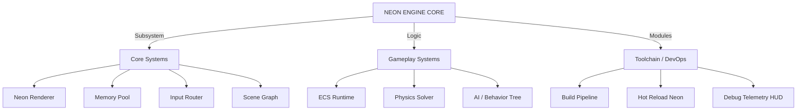
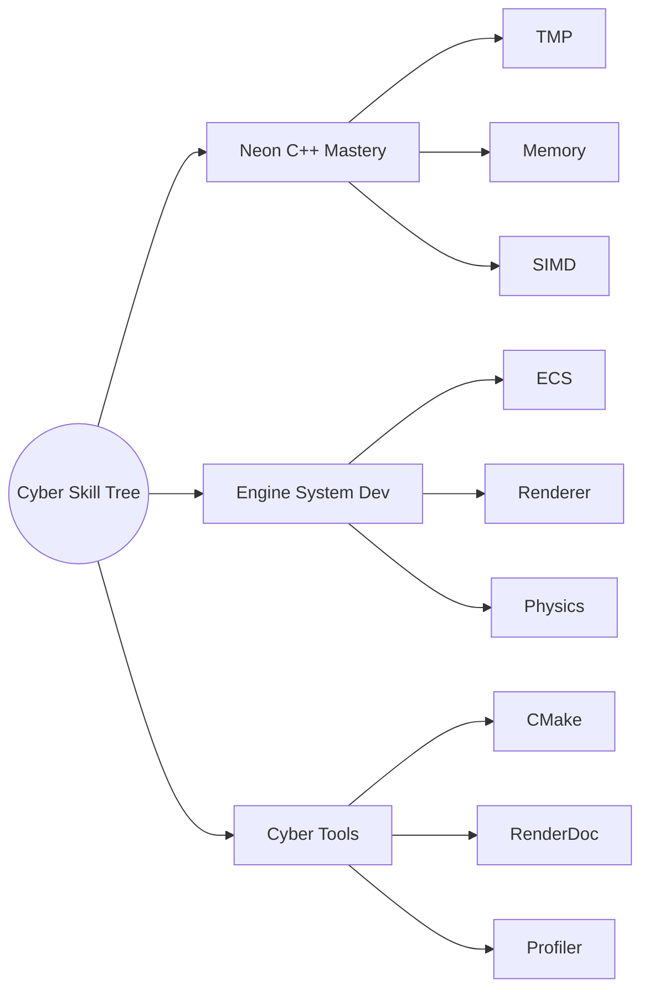

# Cyberpunk Neon README (GitHub-Compatible Markdown)

<div align="center">
  
</div>

```text
┏━━━━━━━━━━━━━━━━━━━━━━━━━━━━━━━━━━━━━━━━━━━━━━━━━━━━━━━━━━━━━━━━━━━━━━━━━━━━━━┓
┃   ⚡ CYBERPUNK NEON TERMINAL — USER: ttdcube                         [ONLINE] ┃
┣━━━━━━━━━━━━━━━━━━━━━━┳━━━━━━━━━━━━━━━━━━━━━━━━━━━━━━━━━━━━━━━━━━━━━━━━━━━━━━┫
┃  [HOLOGRAM AVATAR]   ┃  > SYS://USER_INFO                                    ┃
┃                      ┃                                                      ┃
┃        ⠀(◣_◢)        ┃  ID:        Tien (ttdcube)                           ┃
┃       ═╦══╦═         ┃  Role:      C++ Game Engineer / Indie Dev            ┃
┃      ══╩══╩══        ┃  Origin:    Night-City / Grid Sector 14              ┃
┃        /▎  ▎\        ┃  Engine:    Custom C++ Neon Engine                   ┃
┃       /_▔▔_ \        ┃  Status:    Running SurvivalGame Module              ┃
┣━━━━━━━━━━━━━━━━━━━━━━┻━━━━━━━━━━━━━━━━━━━━━━━━━━━━━━━━━━━━━━━━━━━━━━━━━━━━━━┫
┃  ⚙️ SYSTEM PERFORMANCE METRICS (NEON MODE)                                    ┃
┃                                                                              ┃
┃  [HP] C++ / STL / Math        [██████████████████████░░░░] 88%              ┃
┃  [MP] Gameplay Logic          [███████████████░░░░░░░░░░] 65%              ┃
┃  [XP] Engine Architecture      [████████████░░░░░░░░░░░░░] 50%              ┃
┃  [OC] Optimization / Tools     [██████████████░░░░░░░░░░░] 60%              ┃
┃                                                                              ┃
┣━━━━━━━━━━━━━━━━━━━━━━━━━━━━━━━━━━  TECH STACK  ━━━━━━━━━━━━━━━━━━━━━━━━━━━━━━┫
┃                                                                              ┃
┃  ► Languages:   [ C++20 ] [ C ] [ Dart ]                                     ┃
┃  ► Tools:       [ CMake ] [ Git ] [ VSCode ] [ RenderDoc ]                  ┃
┃  ► Frameworks:  [ SDL2 ] [ OpenGL ] [ Flutter ]                              ┃
┃  ► Systems:     ECS • GPU Debug • Neon Renderer WIP                          ┃
┃                                                                              ┃
┣━━━━━━━━━━━━━━━━━━━━━━━━━━━━━━━━━━ PROJECT LOG ━━━━━━━━━━━━━━━━━━━━━━━━━━━━━━━┫
┃                                                                              ┃
┃  1. SurvivalGame ......... [ ACTIVE ] → Physics + Neon Rendering Pass        ┃
┃  2. EngineTools .......... [ STABLE ] → Auto-build, Asset Sync Tools         ┃
┃  3. FlutterApp ........... [ SLEEP ] → Neon UI Prototype                     ┃
┃                                                                              ┃
┗━━━━━━━━━━━━━━━━━━━━━━━━━━━━━━━━━━━━━━━━━━━━━━━━━━━━━━━━━━━━━━━━━━━━━━━━━━━━━━┛
```

## 🌐 NEON ENGINE ARCHITECTURE MAP



## 🔺 SKILL TREE — NETRUNNER PROTOCOLS



## 📊 NEON ACTIVITY GRID

<div align="center">


</div>

<div align="center">

<br>
<code>NEON GRID SHUTDOWN COMPLETE — STAY SHARP, NETRUNNER.</code>
</div>
